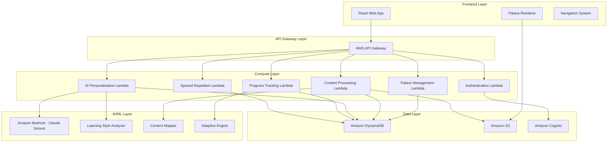

# Design Document: MemoryPalace AI

## Overview

MemoryPalace AI is an intelligent learning platform that combines the ancient Method of Loci technique with modern AI personalization to create virtual memory palaces for enhanced learning retention. The system leverages spatial memory and visual associations to help students achieve 70% retention rates (compared to 50% with traditional methods) through personalized, adaptive learning experiences.

The platform uses a serverless AWS architecture with React frontend, Amazon Bedrock for AI capabilities, and DynamoDB for data persistence. The core innovation lies in the AI-driven personalization engine that adapts palace layouts, content placement, and visual associations based on individual learning profiles and performance data.

## Architecture

### High-Level Architecture




### System Components

## Cost Estimation

### AWS Services Pricing (Estimated for 1,000 users)

| Service | Usage | Monthly Cost |
|---------|-------|-------------|
| Amazon Bedrock (Claude Sonnet) | ~100K requests/month | $50-100 |
| AWS Lambda | ~500K invocations | $1-2 |
| DynamoDB | 5GB storage, on-demand | $5-10 |
| S3 | 50GB storage, 100GB transfer | $3-5 |
| API Gateway | 500K requests | $2 |
| Cognito | 1,000 MAU (Free tier) | $0 |
| **Total Estimated** | | **$61-119/month** |

**Scalability:** Serverless architecture scales automatically with demand.

### System Components

**Frontend Components:**
- **Palace Renderer**: 3D/2D visualization engine for memory palaces
- **Navigation System**: Smooth transitions between palace rooms
- **Content Manager**: Upload and organization of study materials
- **Progress Dashboard**: Analytics and performance tracking
- **Assessment Interface**: Learning style and personality quizzes

**Backend Services:**
- **Authentication Service**: User registration, login, and session management
- **Palace Management Service**: CRUD operations for memory palaces
- **Content Processing Service**: Parse and structure uploaded study materials
- **AI Personalization Service**: Generate personalized content mappings
- **Progress Tracking Service**: Monitor user performance and analytics
- **Spaced Repetition Service**: Schedule and manage review sessions

## Components and Interfaces

### Core Data Models

```typescript
interface User {
  userId: string;
  email: string;
  learningProfile: LearningProfile;
  createdAt: Date;
  lastActiveAt: Date;
}

interface LearningProfile {
  visualPreference: number; // 0-1 scale
  auditoryPreference: number;
  kinestheticPreference: number;
  personalityTraits: PersonalityTraits;
  performanceHistory: PerformanceMetrics[];
}

interface PersonalityTraits {
  openness: number;
  conscientiousness: number;
  extraversion: number;
  agreeableness: number;
  neuroticism: number;
}

interface MemoryPalace {
  palaceId: string;
  userId: string;
  name: string;
  template: PalaceTemplate;
  rooms: PalaceRoom[];
  subject: string;
  createdAt: Date;
  lastAccessedAt: Date;
}

interface PalaceTemplate {
  templateId: string;
  name: string; // "Medieval Castle", "Space Station", "Modern Office"
  description: string;
  roomLayout: RoomLayout[];
  visualAssets: string[]; // S3 URLs
}

interface PalaceRoom {
  roomId: string;
  name: string;
  position: Coordinates;
  contentItems: ContentItem[];
  visualElements: VisualElement[];
  navigationPaths: string[]; // Connected room IDs
}

interface ContentItem {
  itemId: string;
  originalText: string;
  processedContent: ProcessedContent;
  mnemonicAssociations: MnemonicAssociation[];
  position: Coordinates;
  lastReviewed: Date;
  nextReviewDate: Date;
  difficultyLevel: number;
  retentionRate: number;
}

interface MnemonicAssociation {
  visualCue: string;
  spatialCue: string;
  personalizedElement: string;
  associationStrength: number;
}

interface SpacedRepetitionSchedule {
  itemId: string;
  userId: string;
  interval: number; // Days
  easeFactor: number;
  repetitionCount: number;
  lastReviewDate: Date;
  nextReviewDate: Date;
  reviewHistory: ReviewSession[];
}

interface ReviewSession {
  sessionId: string;
  timestamp: Date;
  itemsReviewed: string[];
  accuracy: number;
  timeSpent: number;
  difficultyRating: number;
}
```

### API Interfaces

```typescript
// Palace Management API
interface PalaceAPI {
  createPalace(userId: string, template: string, subject: string): Promise<MemoryPalace>;
  getPalaces(userId: string): Promise<MemoryPalace[]>;
  updatePalace(palaceId: string, updates: Partial<MemoryPalace>): Promise<MemoryPalace>;
  deletePalace(palaceId: string): Promise<void>;
}

// Content Processing API
interface ContentAPI {
  uploadContent(userId: string, file: File): Promise<ProcessedContent>;
  mapContentToPalace(palaceId: string, contentId: string): Promise<ContentMapping>;
  generateMnemonics(content: ProcessedContent, learningProfile: LearningProfile): Promise<MnemonicAssociation[]>;
}

// AI Personalization API
interface PersonalizationAPI {
  analyzeLearningStyle(assessmentData: AssessmentResponse[]): Promise<LearningProfile>;
  personalizeContent(content: ContentItem[], learningProfile: LearningProfile): Promise<ContentItem[]>;
  adaptBasedOnPerformance(userId: string, performanceData: PerformanceMetrics): Promise<AdaptationRecommendations>;
}

// Progress Tracking API
interface ProgressAPI {
  recordSession(userId: string, session: ReviewSession): Promise<void>;
  getProgressMetrics(userId: string, palaceId?: string): Promise<ProgressMetrics>;
  generateInsights(userId: string): Promise<LearningInsights>;
}

// Spaced Repetition API
interface SpacedRepetitionAPI {
  scheduleReview(itemId: string, performance: ReviewPerformance): Promise<SpacedRepetitionSchedule>;
  getDueItems(userId: string): Promise<ContentItem[]>;
  updateSchedule(itemId: string, reviewResult: ReviewResult): Promise<SpacedRepetitionSchedule>;
}
```

### AI Personalization Engine

The AI Personalization Engine uses Amazon Bedrock (Claude Sonnet) to analyze user data and generate personalized content mappings:

```typescript
interface PersonalizationEngine {
  // Analyze learning style from assessment
  analyzeLearningStyle(responses: AssessmentResponse[]): LearningProfile;
  
  // Generate personalized visual associations
  generateVisualAssociations(
    content: string, 
    learningProfile: LearningProfile,
    palaceContext: PalaceRoom
  ): MnemonicAssociation[];
  
  // Adapt content placement based on performance
  adaptContentPlacement(
    currentPlacement: ContentItem[],
    performanceData: PerformanceMetrics,
    learningProfile: LearningProfile
  ): ContentItem[];
  
  // Optimize palace layout for individual user
  optimizePalaceLayout(
    template: PalaceTemplate,
    learningProfile: LearningProfile,
    contentStructure: ContentStructure
  ): PalaceTemplate;
}
```

## Data Models

### Database Schema (DynamoDB)

**Users Table:**
- Partition Key: `userId` (String)
- Attributes: `email`, `learningProfile`, `createdAt`, `lastActiveAt`

**Palaces Table:**
- Partition Key: `userId` (String)
- Sort Key: `palaceId` (String)
- Attributes: `name`, `template`, `rooms`, `subject`, `createdAt`, `lastAccessedAt`

**Content Table:**
- Partition Key: `palaceId` (String)
- Sort Key: `itemId` (String)
- Attributes: `originalText`, `processedContent`, `mnemonicAssociations`, `position`, `retentionMetrics`

**SpacedRepetition Table:**
- Partition Key: `userId` (String)
- Sort Key: `itemId` (String)
- Attributes: `interval`, `easeFactor`, `repetitionCount`, `lastReviewDate`, `nextReviewDate`
- GSI: `nextReviewDate-index` for efficient due item queries

**Sessions Table:**
- Partition Key: `userId` (String)
- Sort Key: `timestamp` (String)
- Attributes: `sessionId`, `itemsReviewed`, `accuracy`, `timeSpent`, `difficultyRating`

### Content Processing Pipeline

```typescript
interface ContentProcessor {
  // Parse uploaded content
  parseContent(file: File): Promise<RawContent>;
  
  // Extract key concepts and structure
  extractConcepts(content: RawContent): Promise<ConceptMap>;
  
  // Generate content hierarchy
  structureContent(concepts: ConceptMap): Promise<ContentHierarchy>;
  
  // Create spatial mappings
  mapToSpatialLocations(
    hierarchy: ContentHierarchy,
    palace: PalaceTemplate
  ): Promise<SpatialMapping>;
}

interface ConceptMap {
  mainConcepts: Concept[];
  relationships: ConceptRelationship[];
  difficulty: DifficultyLevel;
  estimatedStudyTime: number;
}

interface SpatialMapping {
  roomAssignments: RoomAssignment[];
  navigationFlow: NavigationPath[];
  visualCues: VisualCueMapping[];
}
```

## Correctness Properties

*A property is a characteristic or behavior that should hold true across all valid executions of a system—essentially, a formal statement about what the system should do. Properties serve as the bridge between human-readable specifications and machine-verifiable correctness guarantees.*

Based on the prework analysis, here are the key correctness properties for MemoryPalace AI:

### Property 1: Template Selection and Initialization
*For any* palace template selection, the system should initialize a palace with the exact structure and visual elements defined in the selected template
**Validates: Requirements 1.2, 1.3**

### Property 2: Multi-Palace Isolation
*For any* user with multiple memory palaces, content and progress data should remain completely isolated between palaces of different subjects
**Validates: Requirements 7.1, 7.2, 7.3**

### Property 3: Learning Profile Generation
*For any* valid assessment response set, the AI personalization engine should generate a learning profile with all required personality traits and learning preferences within valid ranges
**Validates: Requirements 2.1, 2.2**

### Property 4: Personalized Content Mapping
*For any* content item and learning profile combination, the content mapper should generate visual and spatial associations that reflect the user's learning preferences
**Validates: Requirements 2.3, 3.2, 3.3**

### Property 5: Content Processing Round-Trip
*For any* uploaded study material, parsing then structuring then extracting concepts should preserve all key information from the original content
**Validates: Requirements 9.1, 9.2**

### Property 6: Adaptive Learning Response
*For any* user performance data indicating poor recall, the adaptive learning system should modify content placement and visual associations to improve future performance
**Validates: Requirements 4.2, 4.3**

### Property 7: Progress Tracking Accuracy
*For any* completed review session, the system should accurately calculate and update retention rates, time correlations, and progress metrics in real-time
**Validates: Requirements 5.1, 5.2, 5.3**

### Property 8: Spaced Repetition Algorithm
*For any* review session result, the spaced repetition engine should adjust intervals according to established forgetting curve principles (increase on success, decrease on failure)
**Validates: Requirements 6.1, 6.2, 6.3**

### Property 9: Cross-Device Synchronization
*For any* user logging in from different devices, all palace data, progress metrics, and learning profiles should be synchronized and consistent across devices
**Validates: Requirements 8.3**

### Property 10: Navigation and Room Entry
*For any* palace room navigation, entering a room should display all associated content items with their mnemonic associations and interactive exercises
**Validates: Requirements 10.1, 10.2**

### Property 11: Content Library Management
*For any* content added to the user's library, it should be persistently stored, editable, and reusable across multiple palace mappings
**Validates: Requirements 9.3, 9.4**

### Property 12: Notification Scheduling
*For any* spaced repetition schedule, the system should send notifications at the calculated optimal review times
**Validates: Requirements 6.4**

<function_calls>
<invoke name="prework">
<parameter name="featureName">memorypalace-ai

## Deployment Strategy

### CI/CD Pipeline
- **Source Control:** GitHub
- **Build:** GitHub Actions
- **Testing:** Automated test suite on every commit
- **Staging:** AWS Amplify preview environments
- **Production:** AWS Amplify with manual approval gate

### Infrastructure as Code
- AWS CDK for infrastructure provisioning
- DynamoDB tables, Lambda functions, S3 buckets defined in code
- Environment variables managed via AWS Systems Manager Parameter Store

### Rollout Strategy
- **Phase 1:** Beta launch with 50 users
- **Phase 2:** Open beta with monitoring
- **Phase 3:** General availability with auto-scaling

## Security Architecture

### Authentication & Authorization
- **User Authentication:** AWS Cognito with MFA support
- **API Authorization:** JWT tokens validated by API Gateway
- **Role-Based Access:** Users can only access their own palaces

### Data Protection
- **Encryption at Rest:** DynamoDB encryption enabled
- **Encryption in Transit:** TLS 1.3 for all API calls
- **S3 Security:** Private buckets with pre-signed URLs for access

### Privacy Compliance
- **Data Minimization:** Only collect essential user data
- **User Rights:** Data export and deletion capabilities
- **Audit Logging:** CloudWatch logs for security events

## Monitoring and Observability

### AWS CloudWatch
- **Metrics:** Lambda execution time, API latency, error rates
- **Alarms:** Trigger on high error rates or latency spikes
- **Dashboards:** Real-time system health visualization

### Application Insights
- **User Analytics:** Track palace creation, content uploads, review sessions
- **Performance Metrics:** 70% retention rate target monitoring
- **Error Tracking:** AI service failures, content processing errors

### Logging
- **Structured Logging:** JSON format for all Lambda functions
- **Log Aggregation:** CloudWatch Logs Insights for querying
- **Retention:** 30-day log retention for debugging

## Error Handling

### Content Processing Errors
- **Invalid File Formats**: Gracefully handle unsupported file types with clear error messages
- **Content Parsing Failures**: Provide fallback text extraction methods for corrupted or complex documents
- **Large File Handling**: Implement file size limits and chunked processing for large documents
- **Empty Content**: Handle empty or whitespace-only content with appropriate user feedback

### AI Service Errors
- **Bedrock API Failures**: Implement retry logic with exponential backoff for transient failures
- **Rate Limiting**: Queue requests and implement graceful degradation when API limits are reached
- **Invalid AI Responses**: Validate AI-generated content and provide fallback associations
- **Personalization Failures**: Use default templates when personalization engine fails

### Data Persistence Errors
- **DynamoDB Failures**: Implement retry logic and eventual consistency handling
- **S3 Upload Failures**: Provide retry mechanisms and temporary local storage
- **Data Corruption**: Implement data validation and backup/restore mechanisms
- **Concurrent Access**: Handle race conditions in palace updates and progress tracking

### User Experience Errors
- **Network Connectivity**: Implement offline mode with local storage and sync when reconnected
- **Session Timeouts**: Gracefully handle authentication expiration with automatic re-authentication
- **Browser Compatibility**: Provide fallback rendering for unsupported browser features
- **Performance Degradation**: Implement loading states and progressive enhancement

### Spaced Repetition Errors
- **Scheduling Conflicts**: Handle overlapping review sessions and priority management
- **Algorithm Failures**: Provide fallback scheduling when adaptive algorithms fail
- **Notification Failures**: Implement multiple notification channels and retry mechanisms

## Testing Strategy

### Dual Testing Approach

The testing strategy employs both unit testing and property-based testing to ensure comprehensive coverage:

**Unit Tests** focus on:
- Specific examples and edge cases
- Integration points between components
- Error conditions and boundary cases
- UI component behavior and user interactions

**Property Tests** focus on:
- Universal properties that hold for all inputs
- Comprehensive input coverage through randomization
- Algorithm correctness across diverse scenarios
- Data integrity and consistency properties

### Property-Based Testing Configuration

- **Testing Framework**: Use fast-check for TypeScript/JavaScript property-based testing
- **Minimum Iterations**: 100 iterations per property test to ensure statistical confidence
- **Test Tagging**: Each property test must reference its design document property
- **Tag Format**: `Feature: memorypalace-ai, Property {number}: {property_text}`

### Unit Testing Focus Areas

**Authentication and User Management:**
- User registration with various input combinations
- Login/logout flows and session management
- Learning profile creation and updates
- Cross-device synchronization edge cases

**Content Processing:**
- File upload with different formats (PDF, text, images)
- Content parsing edge cases (empty files, corrupted data)
- Concept extraction accuracy with sample documents
- Mnemonic association generation

**Palace Management:**
- Template selection and initialization
- Room navigation and content display
- Multi-palace creation and switching
- Bookmark functionality

**Spaced Repetition:**
- Interval calculation with known performance data
- Schedule updates based on review results
- Notification timing and delivery
- Algorithm adaptation scenarios

**Progress Tracking:**
- Retention rate calculations with sample data
- Analytics generation and insight extraction
- Dashboard rendering with various data sets
- Report generation accuracy

### Integration Testing

**End-to-End Workflows:**
- Complete user onboarding flow (registration → assessment → palace creation)
- Content upload → processing → palace mapping → review cycle
- Multi-device synchronization scenarios
- Performance tracking and adaptation cycles

**API Integration:**
- Amazon Bedrock AI service integration
- DynamoDB data operations and consistency
- S3 file storage and retrieval
- Cognito authentication flows

### Performance Testing

**Load Testing:**
- Concurrent user sessions and palace access
- Large content processing and mapping
- Spaced repetition scheduling at scale
- Database query performance under load

**Memory and Resource Testing:**
- Palace rendering performance with complex layouts
- Content processing memory usage
- AI service response times and resource consumption
- Mobile device performance optimization

### Security Testing

**Authentication Security:**
- JWT token validation and expiration
- Session management and concurrent login handling
- Password security and reset flows
- API endpoint authorization

**Data Security:**
- User data encryption at rest and in transit
- Content privacy and access controls
- Cross-user data isolation verification
- Audit logging and compliance